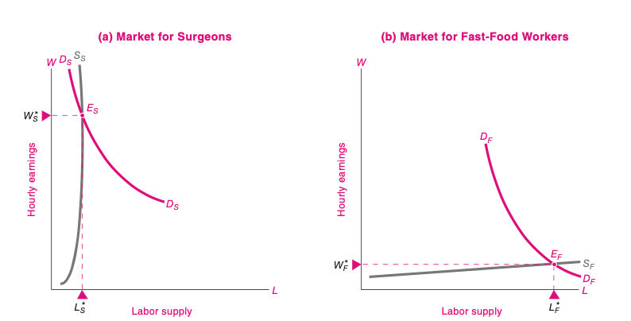
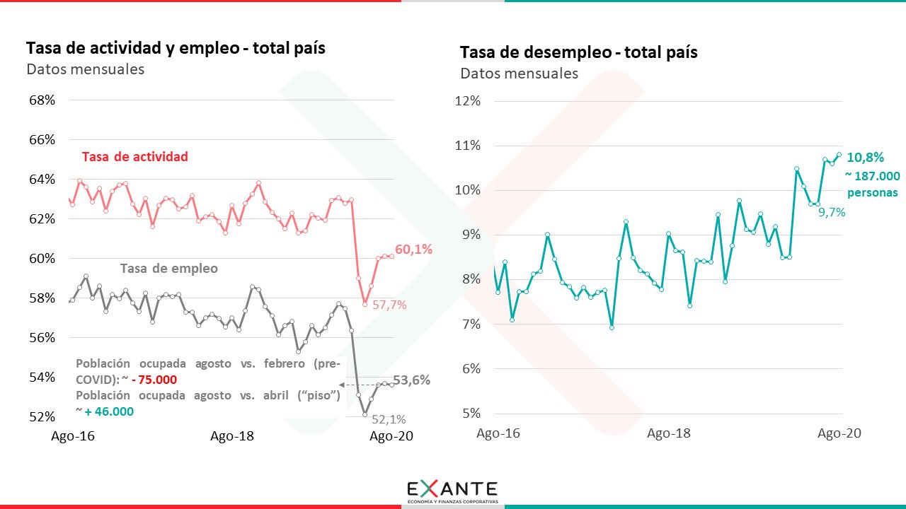
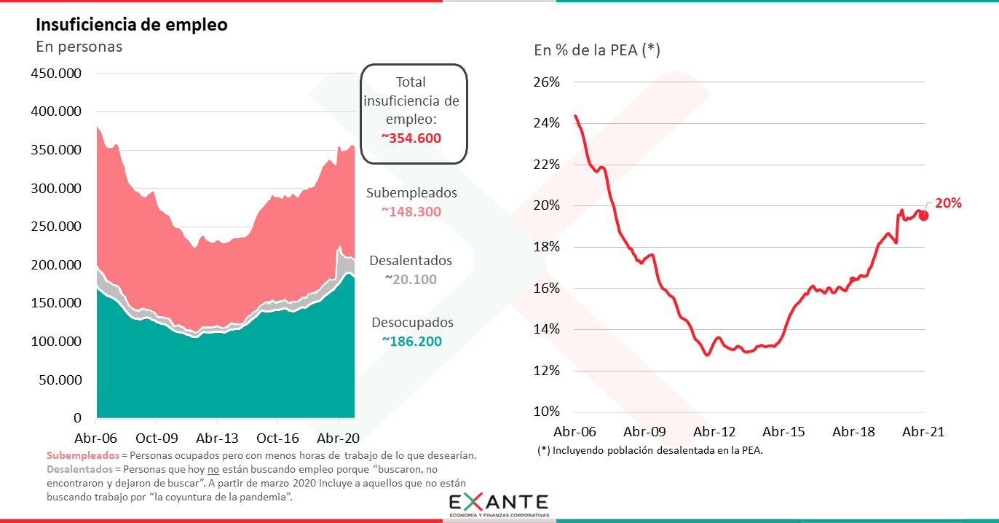
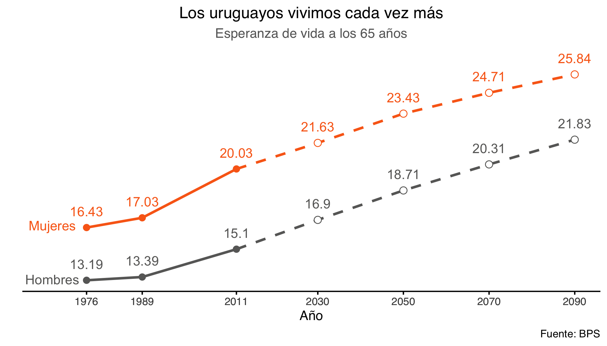

```{r setup, include=FALSE}
options(htmltools.dir.version = FALSE)
knitr::opts_chunk$set(
  fig.width=6, fig.height=3.5, fig.retina=3,
  out.width = "100%",
  cache = FALSE,
  echo = FALSE,
  message = FALSE, 
  warning = FALSE,
  hiline = TRUE,
  dev = "png", 
  dev.args = list(type = "cairo-png")
)

library(tibble)
library(ggplot2)
library(showtext)
font_add_google("Lato", "Lato")
font_add_google("Merriweather", "Merriweather")
theme_set(theme_minimal(base_family = 'Lato', base_size=16))
```

```{r xaringan-themer, include=FALSE, warning=FALSE}
library(xaringanthemer)


colores <- c(celeste="#5e82ae", 
             color3="#89a2c3",
             color1="#698BB4",
             color2="#5D81AD",
             verde="#4E7B7B")

# ,,5D81AD,,000000
style_mono_accent(
  base_color = "#5e82ae",
  #secondary_color = "",
  header_font_google = google_font("Lato"),
  text_font_google   = google_font("Merriweather"),
)

library(ggplot2)

library(tidyverse)
library(kableExtra)
library(extrafont)
library(latex2exp)

options(knitr.kable.NA = '')


naranja <- "#f1a340"
violeta <- "#5e3c99"
violeta_claro <- "#b2abd2"
rojo <- "#e66101"
```


<!-- # Riqueza e ingresos -->

<!-- - El ingreso es un flujo monetario. -->
<!-- - La riqueza es un stock de activos que reportan un ingreso. -->


# Ingresos y Factores de Producción


---
# Los ingresos de los hogares

- Ingresos vs. riqueza
- Los hogares ofrecen los factores productivos
- Obtienen ingresos por venderle estos servicios a las empresas

---
# Demanda de trabajo

- Las empresas demandan trabajo.

- Esta demanda depende de cuánto obtienen por lo que producen con este trabajo en el mercado.

- Demanda derivada.


---
background-image: url("imgs/temps-modernes1.jpeg")
background-position: right bottom

#  El Valor del Producto Marginal

Es el aumento en los ingresos de la empresa por contratar un trabajador extra.

---
# ¿Cuántos trabajadores contratan las empresas?

```{r}
df <- tribble(
  ~Q, ~TP, ~MP, ~VMP,
  0,  0,   0,   0,
  1,  7,   7,   14,
  2,  13,  6,   12, 
  3,  18,  5,   10,
  4,  22,  4,   8,
  5,  25,  3,  6
)

df %>% 
  knitr::kable(col.names = c("L", "Producto Total",
                             "Producto Marginal", "VPMG T")) %>% 
  kable_styling()
```


```{r results="hide"}
# Grafico base
plt <- df %>% 
  ggplot(aes(Q, VMP)) +
  geom_col(fill="gray70") +
  scale_x_continuous(breaks=1:6) +
  scale_y_continuous(breaks=seq(0, 16, by=2))

```

---
# Si el VPMg > W


```{r}
# Q=2 no es de equilibrio
plt +
  geom_col(data=filter(df, Q==2), size=4, fill=violeta_claro) + 
    geom_hline(yintercept=10, 
             linetype="dashed", color=rojo) +
  annotate("text", label="W", color=rojo,
           x=5.5, y=10.8) +
  labs(caption="Si el valor marginal del trabajo es mayor que el salario, \nel empresario aumenta sus beneficios si contrata un trabajador más.")
```


---
# Si el VPMg < W


```{r}
plt + 
    geom_hline(yintercept=10, 
             linetype="dashed", color=rojo) +
  annotate("text", label="W", color=rojo,
           x=5.5, y=10.8) +
  geom_col(data=filter(df, Q==4), size=4, fill=violeta_claro) +
  labs(caption="Si el valor marginal del trabajo es menor que el salario, \nel empresario aumenta sus beneficios si contrata un trabajador menos.")

```


---

# Maximización de Beneficios

```{r}
plt  + 
    geom_hline(yintercept=10, 
             linetype="dashed", color=rojo) +
  annotate("text", label="W", color=rojo,
           x=5.5, y=10.8) + 
  geom_col(data=filter(df, Q==3), size=4, fill=rojo) +
  labs(title=TeX("$ W= VPMg(Q) = P \\times PMg(Q)$"),
                 caption="En equilibrio, el salario y el VPMg son iguales.")

```

---
# ¿Qué pasa si sube el salario?

```{r}
plt +
  geom_col(data=filter(df, Q==3), fill=violeta) +
  geom_hline(yintercept=10, 
             linetype="dashed", 
             color=violeta) +
  annotate("text", 
           label="W[1]", 
           parse=TRUE,
           color=violeta,
           x=4.5, y=10.8) +
geom_hline(yintercept=12, 
             linetype="dashed", color=naranja) +
    geom_col(data=filter(df, Q==2), fill=naranja) +

  annotate("text", label="W[2]", parse=TRUE, color=naranja,
           x=3.5, y=12.8) +
  labs(caption="Si el salario sube de 10 a 12, 
       la cantidad de trabajo demandada baja de 3 a 2.")
```

---

# Curva de demanda de trabajo


- Si sube el salario, la cantidad de trabajadores contratados (L) debe bajar, por el supuesto de rendimientos decrecientes.

- Esto implica que la demanda de trabajo tiene __pendiente negativa__.


---
# La oferta de trabajo

- Los trabajadores ofrecen su trabajo en el mercado.

- Suponemos que si les pagan más, querrán trabajar más, por lo que la curva de oferta tiene __pendiente positiva__.

---
# Equilibrio en el mercado de trabajo


---
# Mercado de trabajo segmentado




---
## Clasificación de la población:

- PET: Población en edad de trabajar (14+)

- PEA: Trabajan o buscan trabajo.


---
## Indicadores del desempeño del mercado de trabajo

- Las agencias de estadísticas reportan algunos indicadores estándar para evaluar el desempeño del mercado laboral de cada país.

--
### Tasa de Empleo
$$TE = \frac{O}{PET}$$

--
### Tasa de Desocupación
$$TD = \frac{D}{PEA}$$

--
### Tasa de actividad

$$TA = \frac{PEA}{PET}$$


---
## Mercado de trabajo en Uruguay: Evolución Reciente




---
# Indicadores

<iframe width="560" height="315" src="https://www.youtube.com/embed/B8VclnrVEPA" title="YouTube video player" frameborder="0" allow="accelerometer; autoplay; clipboard-write; encrypted-media; gyroscope; picture-in-picture" allowfullscreen></iframe>


---
## Desempleados desalentados

- Cuando alguien deja de buscar trabajo porque pierde la esperanza de conseguir un empleo.
- No figuran en la tasa de desempleo (salen de la PEA).
- Pasa cuando las crisis coyunturales se prolongan.
- ¿Qué tasa tengo que mirar para evitar ese potencial problema?


---
## Otros problemas de empleo



---
## Diferencias en el mercado laboral

<blockquote class="twitter-tweet"><p lang="es" dir="ltr"><a href="https://twitter.com/hashtag/InformeCapital?src=hash&amp;ref_src=twsrc%5Etfw">#InformeCapital</a> Columna <br><br>Economía con <a href="https://twitter.com/German_Deagosto?ref_src=twsrc%5Etfw">@German_Deagosto</a>: &quot;Los jóvenes y el mercado laboral&quot;. <a href="https://t.co/hzFHVXfYmW">pic.twitter.com/hzFHVXfYmW</a></p>&mdash; Informe Capital (@infocapitaluy) <a href="https://twitter.com/infocapitaluy/status/1428490715806507010?ref_src=twsrc%5Etfw">August 19, 2021</a></blockquote> <script async src="https://platform.twitter.com/widgets.js" charset="utf-8"></script>
---
## Tres Tipos de desempleo
  
- Cíclico

- Estructural

- Friccional

---
background-image: url("imgs/unemployed.jpeg")
background-position: bottom right
background-size: 600px 450px
## Desempleo Cíclico


El nivel de actividad económica es cíclico. En fases de __expansión__ el desempleo baja. En fases de __contracción__ el desempleo sube.

---
background-image: url("https://media.giphy.com/media/8AsDKgzfouxJC/source.gif")
background-position: bottom right
## Desempleo Estructural

Los cambios en la __estructura productiva__ de la economía producen reasignación de trabajadores de un sector a otro.


---
## Desempleo Friccional

El mercado laboral tiene _fricciones_ que hacen que las personas que cambian de trabajo pasen un tiempo desempleadas.


---

## Mercado de trabajo en Uruguay: Evolución de mediano plazo


- Envejecimiento de la población

- Aumento de la tasa de actividad

- Retraso en las edades de ingreso y egreso al mercado de trabajo

- Cambio tecnológico

---
# Envejecimiento de la población (1)


---
## Causas

- Reducción en la tasa de natalidad

- Aumento de la esperanza de vida




---
background-image: url("imgs/pareja_trabaja.png") 
background-position:  left top

.pull-right[

  ## Mayor participación femenina en el mercado de trabajo

]


---
## Activos por sexo


